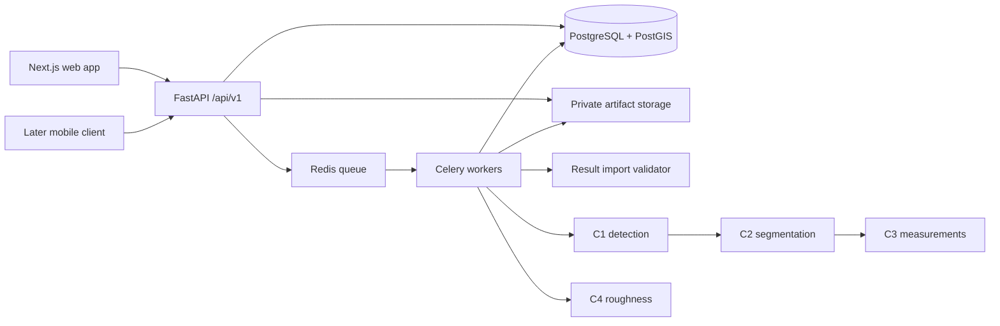

# RoadLens web application architecture

Design baseline: 7 October 2026. Status: recommended implementation design; services and contracts below are not implemented yet.

## 1. Scope and development sequence

Build the shared web platform while the four members develop their research components independently. Start with manual import of component results and evidence. Then support manual raw-data upload and server-side inference. Add mobile capture and upload after the web workflow works. Live streaming is a separate future capability, not required by this design.

The phrase "manual upload" can mean either results or raw data. This design supports both explicitly, with result import as the first milestone. Research training, model architecture, and scientific severity thresholds remain component-owner responsibilities.

Existing repository baseline: Next.js 16.3.8, React 19.2.8, TypeScript and Tailwind 4; Python 3.11, FastAPI, Pydantic 2 and uv; Node 22 Docker image; frontend/backend Compose services; a health endpoint. Existing lockfiles remain authoritative. No database, upload workflow, authentication or component execution is implemented in the inspected scaffold.

## 2. Component boundaries from the proposals

| Component / member | Platform receives | Relationship |
|---|---|---|
| C1 / IT23262690 | Damage observations, classes, boxes, confidence, frame/time/location, crops and consolidated defect identity | Supplies C2; owns detection and temporal consolidation |
| C2 / IT23245860 | Binary masks, crack skeletons and confidence information | Consumes C1 regions; supplies C3 |
| C3 / IT23234420 | Pothole depth/area/volume or crack dimensions, severity and reliability/review flags | Consumes C2 plus RGB and required geometry/calibration metadata |
| C4 / IT23222472 | Good/Regular/Bad roughness assessment with segment/time/location | Independent sensor branch; does not depend on C1-C3 |

C3's own report places specialized reference geometry mainly in training/validation; do not make LiDAR or stereo uploads mandatory for routine operation. Preserve optional geometry and calibration inputs and record the deployed model's requirements. C2's report uses inconsistent output-suite counts: define actual named artifacts rather than a count. Never equate C4 roughness class with C3 defect severity or invent a combined pavement score.

## 3. Architecture and technology decisions

Use a modular monolith: one application API with clearly separated domains, and background workers when asynchronous imports/inference are introduced. Avoid a separate HTTP service per component until conflicting dependencies or independent deployment justify it.



| Concern | Decision | Reason / boundary |
|---|---|---|
| System of record | PostgreSQL + PostGIS | Relational ownership, transactions, survey/result joins and indexed map queries in one database |
| Database access | SQLAlchemy 2, psycopg 3, GeoAlchemy2, Alembic | Typed persistence, spatial columns and versioned migrations; use synchronous DB sessions initially |
| Flexible metadata | PostgreSQL JSONB | Versioned component metadata; queryable core fields stay typed columns |
| Media and arrays | Private filesystem volume initially, behind an artifact-store interface; private S3-compatible object storage for hosted deployment | Keeps video and large arrays outside database rows; DB stores metadata, checksum and opaque storage key |
| Background execution | Celery + Redis, introduced for queued imports/inference | API returns promptly; independent CPU/GPU workers; PostgreSQL stores durable job/result state |
| Browser updates | Poll job endpoint every 2-5 seconds while active, with backoff | Enough for upload-first workflow; SSE optional later |
| Map | Leaflet through React Leaflet, loaded client-side | GeoJSON points/lines and raster basemaps; configure a tile provider and attribution separately |
| Authentication | Invite-only accounts, Argon2id password hashes, opaque server-side sessions | Simple initial web deployment; keep auth policy in FastAPI |
| API contracts | Pydantic models, OpenAPI, generated TypeScript types | Same validation for imported and computed results |
| Deployment | Existing Docker Compose extended incrementally | Suitable for local development and an initial single-host deployment |

Do not add MongoDB, a time-series database, a vector database, Kubernetes, or a model registry service for the first milestone. Raw sensor sequences belong in files; database rows represent surveys, windows, results and provenance. Redis is not the permanent result database. Pin tested releases in lockfiles/images when implementing; the decisions above do not claim compatibility has already been tested.

## 4. User workflows and screens

1. Sign in; choose a project. Roles: administrator manages members, analyst uploads/runs/reviews, viewer reads permitted results.
2. Create a survey with name, route, acquisition date, optional vehicle/device metadata and capture clock information.
3. Choose **Import results** or, once available, **Process raw data**. Upload manifest and selected evidence files. Show per-file progress and validation errors with record/field locations.
4. Preview validated counts, component versions, missing prerequisites and location coverage. Confirm import or select eligible processing branches.
5. Survey detail shows separate C1-C4 status, source files, run history and warnings. One branch failing must not hide another branch's results.
6. Map displays defect markers and roughness segments as separate layers. Filter by survey/date/class/review status and viewport. Unlocated records appear in the table with an explicit missing-location state.
7. Defect detail shows source crop, mask/skeleton overlays, C3 measurements with units, confidence/review flags, and provenance. Segment detail shows C4 class and interval.
8. Reviewer records accept/reject/needs-review decisions and notes without modifying model outputs. Export filtered CSV or GeoJSON; export manifest records the selected run versions.

Suggested routes: `/login`, `/surveys`, `/surveys/new`, `/surveys/[id]`, `/map`, `/defects/[id]`, `/segments/[id]`, `/jobs/[id]`, `/settings/members`. Dashboard summaries must use the same selected runs and filters as the map.

## 5. Database model

Use UUID primary keys, UTC `timestamptz`, foreign keys and explicit project ownership. Scope all queries through membership, including job polling and artifact downloads.

| Table | Main fields / constraints |
|---|---|
| users, projects, memberships, sessions | Unique normalized email; unique project/user membership; hashed session token, expiry and revocation |
| surveys | project_id, name, source_kind, capture_start_at, device/vehicle metadata, upload state |
| artifacts | survey_id, kind, storage_key, original_name, media_type, byte_size, SHA-256, validation_state; immutable once verified |
| frames | survey_id, artifact_id, frame_index, timestamp_ms, width, height, optional location and GPS accuracy |
| road_segments | project_id, optional route identity, geometry(LineString,4326); stable spatial entity, not a prediction |
| component_runs | survey_id, component, source(import/inference/mock), schema/model/code versions, config, status, idempotency_key, timestamps |
| run_inputs | run_id, input artifact or upstream run references; exact dependency provenance |
| defects | survey_id, external_damage_id, C1 run_id, optional representative location; unique(run_id, external_damage_id) |
| observations | defect_id, frame_id, bbox, class, confidence, timestamp, optional location; repeated observations do not become additional defects |
| segmentations | C2 run_id, defect_id, source_observation_id, mask/skeleton/confidence artifact references and pixel transform |
| measurements | C3 run_id, segmentation_id, nullable SI dimensions, severity, reliability, review_required, unavailable_reason |
| roughness_results | C4 run_id, segment_id, time interval, class, optional confidence, quality metadata |
| jobs, job_attempts, outbox_events | Requested work, dependencies, lease/heartbeat, retries, progress, error codes and reliable dispatch |
| reviews, audit_events | Actor, target result/run, decision, note, previous/new state and timestamp |
| survey_result_selections | Explicit current run per component; only compatible upstream versions can be selected together |

Index project/survey foreign keys, run/status, observation time and map filters. Use GiST indexes on spatial columns. Store coordinates as WGS84 longitude/latitude; use geography casts or an appropriate projected CRS for metre distances, never raw degree arithmetic. Map requests require a bounding box, filters and capped result count. Start with clustering and simplified segment geometry; add server aggregation/vector tiles only when measured data volume needs them.

Rerunning C1 creates new defect identities within that run. Preserve previous results; cross-run matching is a future explicit association, not a guessed update. C2/C3 imports must identify existing compatible upstream records, or include them in a validated dependency-ordered import. A missing upstream record blocks that imported result with a useful error.

## 6. Upload and processing lifecycle

API creates an upload session and server-owned artifact IDs. Browser uploads files separately through a streamed upload endpoint initially. Hosted storage may return short-lived presigned upload URLs using the same session abstraction. Avoid routing large media through Next.js rewrites: production ingress routes `/api/v1` directly to FastAPI while keeping a single origin.

Finalize checks actual length/checksum, MIME/signature, media decodability, schema, allowed artifact references and project ownership. Defaults to implement as configurable limits: 2 GiB/video, 25 MiB/image, 250 MiB/CSV, 10 MiB/JSON manifest; larger result tables use streamed JSONL. These are proposed guardrails, not measured capacity. Validate rows incrementally and cap row count, image dimensions, decoded array size and worker runtime. Do not accept executable model files through the survey uploader. Separate-file upload avoids ZIP traversal/decompression issues.

States: upload `created -> uploading -> validating -> ready | rejected | expired`; job `queued -> running -> succeeded | failed | cancelled`, with `retry_wait` for transient failures. A branch can be `blocked`, `skipped` or `not_requested`. Survey summaries derive partial completion from these states; no-results is different from not-processed.

Import jobs validate into staging and publish DB results in one transaction only after referenced artifacts are verified. Files are written first under immutable keys; failed transactions can leave unreferenced objects for garbage collection. Do not mark a run successful until its artifacts and result transaction are committed.

Processing workers receive IDs, not file contents in Redis. A DB transaction creates the job and outbox event; a dispatcher publishes committed events. Enqueue/retry may deliver a task more than once, so unique job idempotency keys, leases and transactional result publication prevent duplicate visible results. Recover expired leases and redispatch pending work after broker loss. Retry only transient errors, initially up to three attempts with backoff; invalid data fails immediately. Cooperative cancellation occurs between files/windows, with explicit partial-artifact cleanup. GPU work starts with concurrency one and a separately configured worker image.

Do not perform inference inside an HTTP request or rely on FastAPI BackgroundTasks for durable jobs. C1->C2->C3 is dependency-aware; C4 runs independently. Workers execute only trusted deployed adapters. Imported outputs and computed outputs pass through the same result validator and persistence service.

## 7. Repository and component delivery

```text
backend/app/
  routes/         # HTTP endpoints only
  schemas/        # public request/response contracts
  models/         # SQLAlchemy tables
  services/       # surveys, imports, orchestration, review, auth
  repositories/   # persistence queries
  storage/        # filesystem and hosted object-store adapters
  workers/        # Celery tasks and dispatch/recovery
backend/migrations/  # Alembic revisions
shared/contracts/    # versioned exchange schemas and fixtures
ml/c1/ ... ml/c4/     # trusted inference adapters and Python code
notebooks/c1/ ...     # optional research notebooks
tests/               # contract, API and integration checks
```

Production and reusable preprocessing/inference code uses `.py`. Colab is a hosted notebook environment; its file format is `.ipynb`. Members may train in Colab/Jupyter, but the app must not launch notebooks or rely on manually executed cells. Each member supplies an importable adapter (or a container if dependency isolation is necessary), model version/checksum, locked dependencies, supported device/memory requirements, preprocessing config, label mapping, schemas, and a small input/output fixture. Inference must run from a clean environment without training or external Drive mounts.

Model weights live in private artifact storage, with metadata in a small DB registry table when inference is added. Choose framework-native weights per component; `.onnx` is optional after parity testing, not a universal requirement. Pickle/joblib/PyTorch checkpoints must only come from trusted deployment assets, never user upload. Keep training datasets, weights, private survey data and notebook outputs out of Git.

## 8. Security, operations and validation

Use HTTPS in deployment. Web session cookie is HttpOnly, Secure, SameSite=Lax; require CSRF protection for mutations. Authorize every object access server-side. Signed media links expire and are issued only after authorization. Keep buckets private, normalize filenames, use opaque storage keys, redact GPS/person information from logs, and avoid logging uploaded contents. Capture faces/plates may need restricted access and redacted display derivatives.

Compose expands to web, API, PostgreSQL/PostGIS, Redis and worker; add object storage only when selecting a hosted/storage deployment. Persist DB and artifacts in distinct volumes, keep secrets out of Git, run migrations as one release step, and expose only the public ingress in production. Separate readiness from liveness and include dependency health in readiness. Structured logs carry request/survey/job/run IDs; monitor failed jobs, queue age, disk usage and worker memory.

Back up the database and artifact store as a coordinated set; rehearse restore before real field data. Retention and deletion must preserve referenced artifacts and model provenance. Garbage-collect only unreferenced abandoned uploads after a configurable grace period. Set project storage quotas before broad access.

Acceptance tests: valid C1-C4 imports display correctly; invalid references/coordinates/mask dimensions reject atomically; repeated requests and worker redelivery create no duplicates; C4 completes with C1-C3 absent; upstream version mismatch blocks C3; missing GPS stays visible outside the map; unauthorized project access fails; model failure is shown without fake data; backup restore recovers both metadata and media. Contract fixtures should use small synthetic or approved examples.

## 9. Implementation order

1. Database migrations, project authorization, artifact-store abstraction and shared schema fixtures.
2. Survey creation and manual result/evidence import; validation preview; run provenance.
3. Map, result details, component status, reviews and CSV/GeoJSON export. This is the first complete web milestone.
4. Worker integration with mock adapters visibly marked as mock, then each real component separately. Add raw video/GPS and IMU uploads with explicit eligibility checks.
5. Mobile batch capture/upload against the same survey API. Add resumable uploads, clock/device metadata and offline retries; decide live streaming only if the field use case requires it.

Open research-owner details do not block the web shell: final C1 class vocabulary, C2 confidence-map availability, C3 calibration/metric-validity rules and severity vocabulary, C4 sensor coordinate conventions/window policy. Hosting budget, expected survey volume, retention and basemap provider need selection before production sizing. The web platform must preserve unavailable/unknown values until these are defined.

## References

Proposal basis: IT23262690.pdf sections 4.1-4.6; IT23245860.pdf sections 3-4; IT23234420_Proposal_Report.pdf sections 5.1-5.3; IT23222472.pdf sections 4.3-4.5. Proposal statements are design inputs, not instructions to execute.

- [PostGIS spatial types and indexes](https://postgis.net/docs/index.html)
- [FastAPI guidance on heavy background computation](https://fastapi.tiangolo.com/tutorial/background-tasks/)
- [Celery task idempotency and acknowledgements](https://docs.celeryq.dev/en/stable/userguide/tasks.html)
